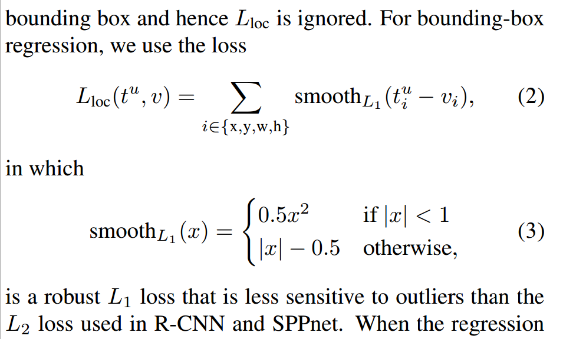

# Faster R-CNN

## 一、架构

### 1. preprocess 数据预处理

输入信息包括：image_data, gt_bboxes, gt_labels, gt_difficults, image_info(h,w,scale)

#### image_data

输入图片尺寸不一，不改变图片的比例。缩放图片使图片尽量贴近600x1000或1000x600。

如图片为400x300，长宽接近1000x600，由于1000/400=2.5, 600/300=2，所以图片被缩放为800x600。

将image_info记录为h=800, w=600, scale=2.

#### gt_bboxes

bboxes相应地按scale比例缩放，保证与image_data一致。

### 2. 提取特征

采用VGG-16网络，提取特征。

输入尺寸为3xhxw, 特征维度为512x(h/16)x(w/16)。

### 3. RPN

采用RPN预测得到proposal region，即目标所在的可能区域。

一个conv3x3把特征再提取一下，提取为512x(h/16)x(w/16)。

对于(h/16)x(w/16)的每个位置，我们会有9个anchor，(3个ratio乘3个size)。基于每一个anchor。我们基于anchor，预测目标位置和置信度。

一个conv1x1，得到(9x4)xhxw，预测目标位置***rpn_locs***, (1x-1x4)。

一个conv1x1，得到(9x2)xhxw，预测确实为目标的置信度***rpn_scores***, (1x-1x2)。

#### 3.1 proposal layer

无需反向求导，用cpu来算的。

基于预测到的目标位置和置信度，得到proposal。区域为rois_np。

1. 将rpn_locs转换为bbox的格式。
2. 对bbox clip到图片内部，防止超出图像边界。
3. 移除很小的bbox，这里时(16/scale)x(16/scale)。
4. 根据前景fg的置信度，进行排序，选前12000个。
5. 进行nms，去除重复率0.7以上的。
6. 对nms的结果，保留2000个。

### 4. 生成AnchorTarget

无需反向求导，用cpu来算的。

***为了训练RPN***，需要给出RPN的数据和label。具体地，给每个anchor指定一个gt_bboxes和label (是否前景）。

如paper中所说 “during training, we ignore all cross-boudary anchors, so, they don't contribute to the loss. Or, they will introduce larget error terms, training will not converge.” 

1. 去掉边界上的anchor。
2. 计算anchors和gt_bboxes间的IoU。
3. 与任何gt_bboxes的IoU小于0.3的anchor，设为负例，label设为0。
4. 对于每个gt_bboxes，与其IoU最大的anchor，设为正例，label设为1。
5. 与任何gt_bboexes的IoU大于0.7的anchor，设为正例，label为1。
6. 剩余anchor设为无关例，label为-1.

我们选择256个样例作为batch，其中正例随机选128个，负例随机选128个。**其他未选中的样例设置为无关样例(label为-1)。**

将gt_bboxes变换一下，作为回归的target。

***整个过程输出的bbox_target和labels，与RPN的rpn_locs和rpn_scores对应求loss。***

整体来说，与gt_bboxes的IoU大于0.7的anchor是正例，对应到相应的gt_bboxes。其他的，如果不足0.3，一般就是负例了。特例是，每个gt_bbox都保证有一个anchor对应（IoU最大的那个anchor）。

### 5. 生成Proposal Target

这一步制作detector网络所需的数据集。

1. 将proposal layer产生的proposal和gt_bboxes放在一起，得到all_rois。
2. 计算all_rois和gt_bboxes间的IoU
3. 我们预期得到128个样例，其中正例占0.25。
4. 每个rois的label设为交集最大的那个gt_bbox所对应的label。
5. IoU大于0.5的rois，视为正例，随机选其中的128x0.25个。
6. IoU小于0.5的rois，视为负例，也随机选
7. 相较rois，将每个roi对应的gt_bboxes（target）转成差值格式。

***这样，我们得到了筛选过的rois, 对应的gt_bboxes和gt_labels。***

### 6. RoI Pooling

RPN中的proposal layer提供了proposal。我们对proposal进行RoI pooling，提取该区域的特征。

简单地讲，RoI pooling能够将不同尺寸的proposal下采样成相同尺寸的特征。这里的特征维度为128x512x7x7。

### 7. Head, Detector

将RoI后的特征拉成一条线。

一个fc，讲特征变成128x4096。

一个fc，讲特征变成128x[(1+20)x4]，作为location，一类物体一个。

一个fc，将特征变成128x[(1+20)x1]，作为score，一类物体一个。


## 二、Loss

### 1. 分类 Cross Entropy Loss

RPN网络关于前景/后景的二分类，Detection网络的20类 (+1类其他)的多分类，使用cross entropy loss。

```python
        self.CELoss_1 = nn.CrossEntropyLoss(ignore_index=-1)
        self.CELoss_2 = nn.CrossEntropyLoss()
```

### 2. 回归 Smooth L1 Loss

paper中的公式如下：


v是GroundTruth的bbox，t是预测的bbox。



看上面公式，如果我们采用L2，则SmoothL1(x)就成了x^2。

初看代码，可能会迷惑。

```python
def x_smooth_l1_loss(x, t, in_weight, sigma):

    sigma2 = sigma ** 2
    diff = in_weight * (x - t)
    abs_diff = diff.abs()
    flag = (abs_diff.data < (1. / sigma2)).float()
    y = (flag * (sigma2 / 2.) * (diff ** 2) +
         (1 - flag) * (abs_diff - 0.5 / sigma2))
    return y.sum()

def x_fast_rcnn_loc_loss(pred_loc, gt_loc, gt_label, sigma):

    in_weight = torch.zeros(gt_loc.shape).cuda()
    # Localization loss is calculated only for positive rois.
    # NOTE:  unlike origin implementation, 
    # we don't need inside_weight and outside_weight, they can calculate by gt_label
    in_weight[(gt_label > 0).view(-1, 1).expand_as(in_weight).cuda()] = 1
    loc_loss = x_smooth_l1_loss(pred_loc, gt_loc, in_weight.detach(), sigma)
    # Normalize by total number of negtive and positive rois.
    loc_loss /= ((gt_label >= 0).sum().float()) # ignore gt_label==-1 for rpn_loss
    return loc_loss

```

由于有些数据无效数据，如gt_label=0的ground truth。所以这里搞了个in_weight，对于gt_label>0的情况是1，其他情况是0（对loss没有贡献）。sigma的玩法比较诡异，再议。


## 三、mAP


## 四、训练

VGG-16特征提取网络的权重是否固定？

